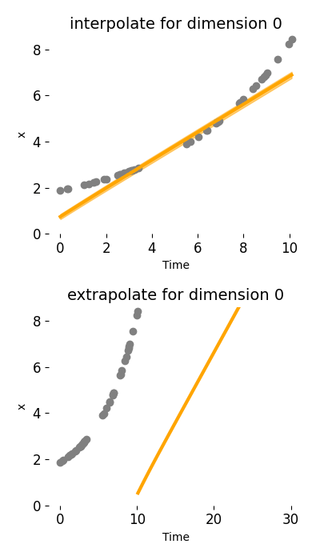

# Neural-ODE and Neural-Flows for time series interpolation and extrapolation

Several points:
- neural-flows achieve better results in interpolation tasks, and perform much worse in extrapolation tasks. It would be a good choice to use neural-flows for missing data imputation as it is faster and has good interpolation ability. However, although the idea is novel, direcly modeling the solution of ODEs doesn't work better or even similarly as neural-ODEs do.
- On the other hand, experiments showed that using neural-ODE and neural-Flows to predict more complex data has long way to go. For instance, it is even better to use that average data in the previous period as estimated data for periodical data compared to neural-ODE and neural-Flows. 

## Prerequisites

Install `torchdiffeq` from https://github.com/rtqichen/torchdiffeq.


## Running script
* Time series interpolation and extrapolation
```
python3 run_models.py --datas sine  --latent-ode --z0-encoder ode --noise-weight 0.01 # using Neural-ODEs
python3 run_models.py --datas sine2  --latent-ode --z0-encoder flow --flow-model coupling --noise-weight 0.01  
python3 run_models.py --datas square  --latent-ode --z0-encoder flow --flow-model resnet --noise-weight 0.01 
python3 run_models.py --datas high  --latent-ode --noise-weight 0.01 
python3 run_models.py --datas sir  --latent-ode --noise-weight 0.01  
python3 run_models.py --datas pp  --latent-ode --noise-weight 0.01  
python3 run_models.py --datas polulation  --latent-ode --noise-weight 0.01  
```

* Time series interpolation and extrapolation
```
python3 run_models.py --data sine  --latent-ode --noise-weight 0.01 
```


## Dynamic results
- We show how Neural-ODE (left) and neural-flow (right) performs in both interpolation and extrapolation tasks.
- Neural-flow quickly converges for the training interval, but perform much worse in extrapolation tasks.
<p align="center">

</p>

- See below Predator-pray model and addtion of sines.  Neural-flows perform better than interpolation tasks. Neural-ODEs perform better than extrapolation tasks.
<p align="center">

</p>

<p align="center">

</p>

- Data with second order dynamics 
<p align="center">

</p>

- Population model
<p align="center">

</p>

- SIR model
<p align="center">

</p>

- Square
<p align="center">

</p>

